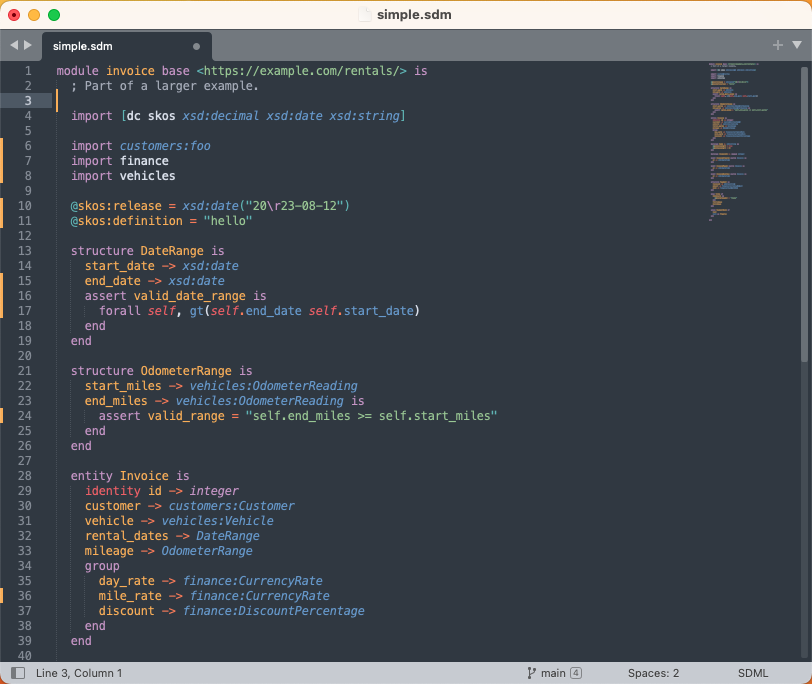
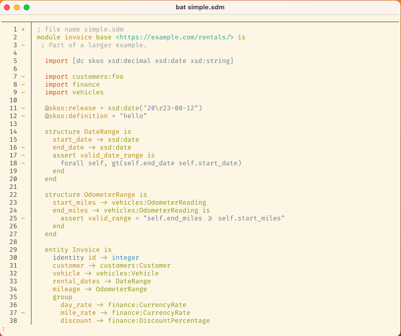

# SDML Package for Sublime Text

```
        ___          _____          ___
       /  /\        /  /::\        /__/\
      /  /:/_      /  /:/\:\      |  |::\
     /  /:/ /\    /  /:/  \:\     |  |:|:\    ___     ___
    /  /:/ /::\  /__/:/ \__\:|  __|__|:|\:\  /__/\   /  /\
   /__/:/ /:/\:\ \  \:\ /  /:/ /__/::::| \:\ \  \:\ /  /:/
   \  \:\/:/~/:/  \  \:\  /:/  \  \:\~~\__\/  \  \:\  /:/
    \  \::/ /:/    \  \:\/:/    \  \:\         \  \:\/:/
     \__\/ /:/      \  \::/      \  \:\         \  \::/
       /__/:/        \__\/        \  \:\         \__\/
       \__\/          Domain       \__\/          Language
        Simple                      Modeling
```

This is a reasonably complete [package](https://www.sublimetext.com/docs/packages.html) for the [Sublime Text](https://www.sublimetext.com/) editor. The provided syntax highlighting is mostly complete
except for formal constraints and type-class method definitions.

Additionally, the invaluable [bat](https://github.com/sharkdp/bat) command-line tool uses `.sublime-syntax` files to do
terminal source highlighting.

A Github workflow attaches a downloadable `.sublime-package` file to each release.

## Features

Syntax highlighting based on a [`.sublime-syntax`](https://www.sublimetext.com/docs/syntax.html) grammar.



Grammar integrated into the `bat` pager.



## Installation

The install script provided will clone this repository into your Sublime Text package location and, if you have `bat`
installed, link the repository into the `bat` configuration folder.

```bash
$ curl https://raw.githubusercontent.com/sdm-lang/sdml-sublime-text/main/install.sh | sh
```

## TODO

1. Copy over snippets from the TextMate bundle.
1. Add configuration for a [build system](https://www.sublimetext.com/docs/build_systems.html).

## Changes

**Version: 0.1.0**

* Initial release, syntax highlighting only.
